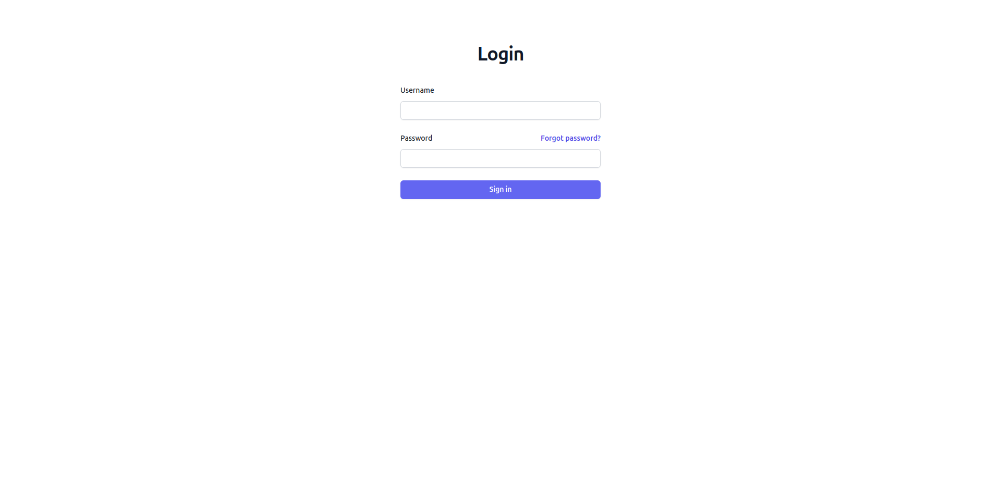
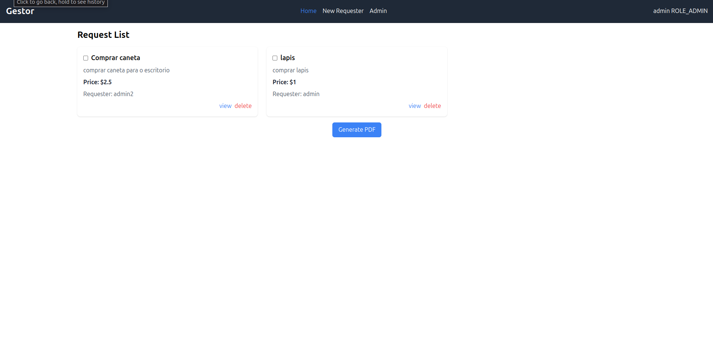
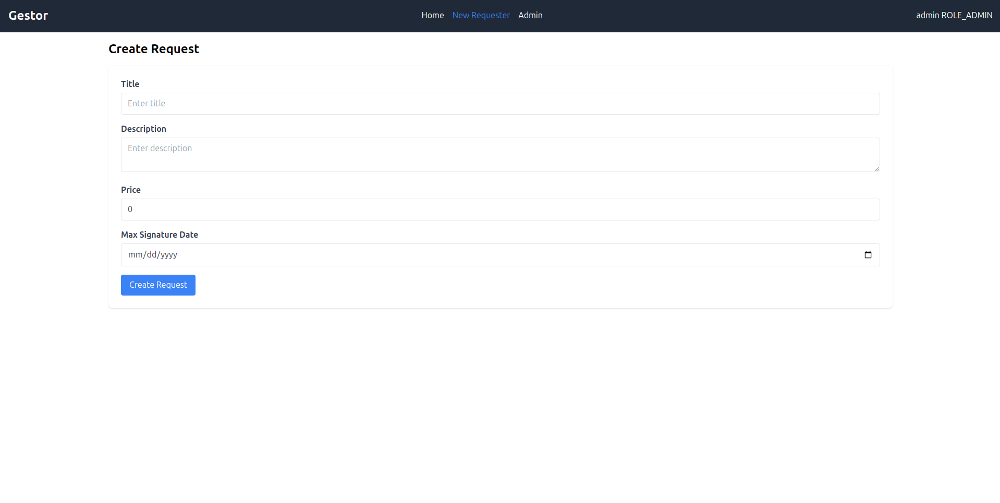
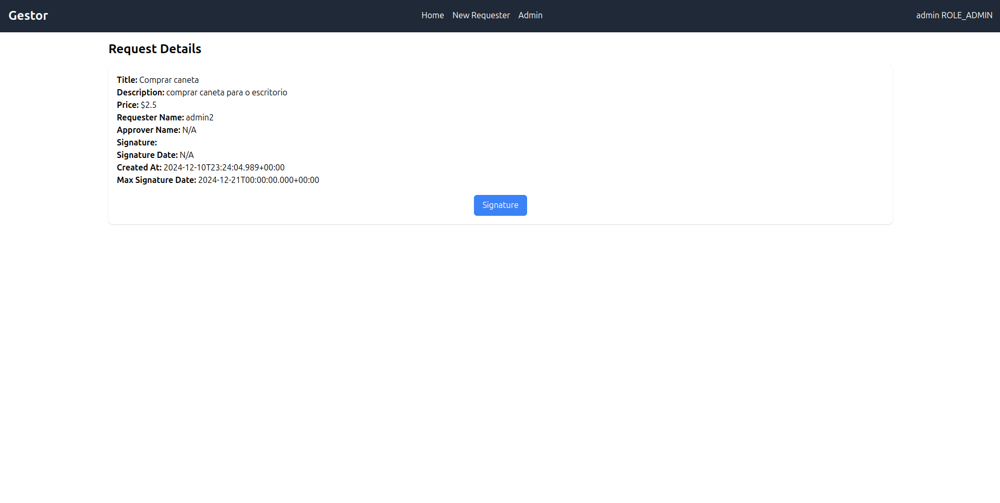
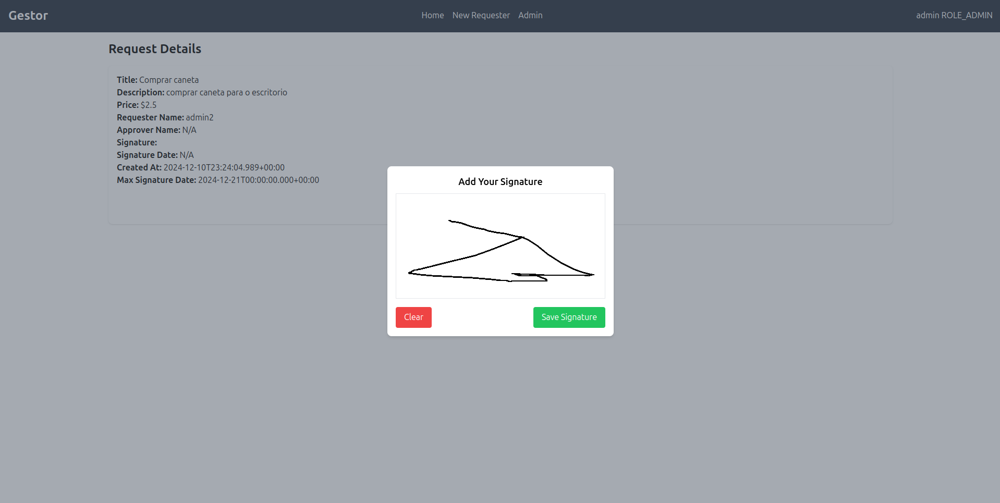
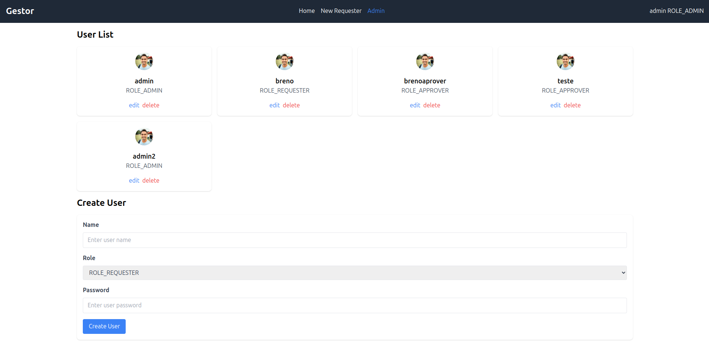

# Gestor de Compras

## 👀 Como ficou ???

</img>
----------
</img>
----------
</img>
----------
</img>
----------
</img>
----------
</img>

## 🧑‍💻 Tecnologias usadas

O projeto foi desenvolvido com as seguintes tecnologias:
- [TypeScript](https://www.typescriptlang.org/)
- [Angular](https://angular.io/)
- [PDF-LIB](https://pdf-lib.js.org/)
- [Tailwind CSS](https://tailwindcss.com/)

## ⌨️ Sobre o projeto

O projeto consiste em um frontend para um sistema de gestor de comprar. Ele foi desenvolvido utilizando Angular como framework principal, Tailwind CSS para estilização.

## 🚀 Rodar o projeto

### 1. Instale as dependências:
Certifique-se de ter o Node.js instalado na sua máquina. Caso não tenha, instale-o [aqui](https://nodejs.org/en/download/).

```bash
npm install
```

### 2. Certifique-se de ter uma API rodando:

A API para este projeto está [gestor-de-compras](https://github.com/BrenoC4rvalho/gestor-de-compras). Clone o repositório da API e siga as instruções do README para configurá-la e executá-la. 

### 3. Inicie o servidor de desenvolvimento:

```bash
npm start
```

### 4. Acesse o projeto no navegador:
Abra [http://localhost:4200](http://localhost:4200) para visualizar o projeto em execução.


